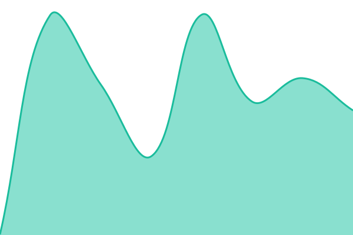
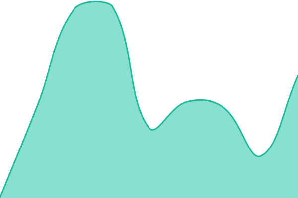

# [📈 Live Status](https://status.totalfamily.io): <!--live status--> **🟩 All systems operational**

**[status.totalfamily.io](https://status.totalfamily.io)** — the public status page for Total Family.

We check our services every few minutes and publish the results here automatically. If something goes down, an incident is opened and stays visible until it is resolved. Nothing is edited by hand.

## Current status

<!--start: status pages-->
<!-- This summary is generated by Upptime (https://github.com/upptime/upptime) -->
<!-- Do not edit this manually, your changes will be overwritten -->
<!-- prettier-ignore -->
| URL | Status | History | Response Time | Uptime |
| --- | ------ | ------- | ------------- | ------ |
|  [Web Application](https://app.totalfamily.io/api/health) | 🟩 Up | [web-application.yml](https://github.com/totalfamily/status/commits/HEAD/history/web-application.yml) | 

 284ms
     
 | 

<a href="https://totalfamily.github.io/status/history/web-application">100.00%</a>
    

|  [Database](https://app.totalfamily.io/api/health) | 🟩 Up | [database.yml](https://github.com/totalfamily/status/commits/HEAD/history/database.yml) | 

 375ms
     
 | 

<a href="https://totalfamily.github.io/status/history/database">100.00%</a>
    

|  [Website](https://totalfamily.io) | 🟩 Up | [website.yml](https://github.com/totalfamily/status/commits/HEAD/history/website.yml) | 

 355ms
     
 | 

<a href="https://totalfamily.github.io/status/history/website">100.00%</a>
    

|  [Help Center](https://help.totalfamily.io) | 🟩 Up | [help-center.yml](https://github.com/totalfamily/status/commits/HEAD/history/help-center.yml) | 

 1031ms
     
 | 

<a href="https://totalfamily.github.io/status/history/help-center">100.00%</a>
    

<!--end: status pages-->

[**Visit the Total Family status page →**](https://status.totalfamily.io)

## What we monitor

| Service         | What it is                                                                    |
| --------------- | ----------------------------------------------------------------------------- |
| **Website**     | [totalfamily.io](https://totalfamily.io) — our public website                 |
| **Help Center** | [help.totalfamily.io](https://help.totalfamily.io) — guides, FAQs and support |

## How this works

Every check runs on a schedule and writes its result straight into this repository:

- **Checks** run automatically and record whether each service responded, and how quickly.
- **Incidents** are opened automatically when a service stops responding, and closed automatically when it recovers. Brief blips under 15 minutes are discarded so they do not appear as false outages.
- **History** is stored in [`history/`](./history) as plain files, so every measurement is timestamped and permanently auditable.
- **The status page** reads this data live, so it always reflects the current state without needing to be redeployed.

There is no server and no database behind any of this — the repository itself is the record.

## Reporting a problem

If something looks wrong and it is not reflected here, please tell us:

- **Email** — [hello@totalfamily.io](mailto:hello@totalfamily.io)
- **Help Center** — [help.totalfamily.io/support/contact-us](https://help.totalfamily.io/support/contact-us)

We aim to respond within one business day.

## About this repository

This repository is public so that anyone can independently verify our uptime record. It contains only monitoring configuration and measurement history — no application code and no customer data.

Most commits here are made automatically by our status bot. Please do not enable branch protection on this repository; it would block those automated commits and freeze the status page.

## License

- Status page built with [Upptime](https://github.com/upptime/upptime) — [MIT](./LICENSE) © [Anand Chowdhary](https://anandchowdhary.com)
- Measurement data in [`history/`](./history) — [Open Database License](https://opendatacommons.org/licenses/odbl/1-0/)
